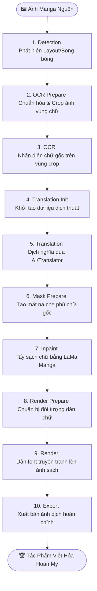

# ⚡ MANGA TRANSLATOR STUDIO - BUỒNG LÁI DỊCH THUẬT TRUYỆN TRANH ĐA BƯỚC

```text
   __  ___                               ________                               __      __
  /  |/  /___ _____  ____ _____ _       /_  __/ /_  ____ _____  _____  / /___ _/ /_____/ /_
 / /|_/ / __ `/ __ \/ / / / __ `/  ______/ / / __ \/ __ `/ __ \/ ___/ / / __ `/ __/ __  / __/
/ /  / / /_/ / / / / /_/ / /_/ /  /_____/ / / / / / /_/ / / / (__  ) / / /_/ / /_/ /_/ / /_  
/_/  /_/\__,_/_/ /_/\__, /\__,_/        /_/ /_/ /_/\__,_/_/ /_/____/ /_/\__,_/\__/\__,_/\__/  
                  /____/                                                                      
            [ BUỒNG LÁI XỬ LÝ & DỊCH THUẬT TRUYỆN TRANH TOÀN DIỆN CHO WIBU CHUYÊN NGHIỆP ]
```

**Manga Translator Studio** là một bộ công cụ dịch thuật truyện tranh (manga/comic) chuyên nghiệp được xây dựng trên nền tảng **PyQt6** dành cho các dịch giả và editor khó tính nhất. 

Khác biệt hoàn toàn so với các công cụ dịch tự động một nút bấm cẩu thả làm biến dạng art và xô lệch khung thoại, dự án này áp dụng triết lý dịch thuật **Human-in-the-loop** (con người kiểm soát quy trình) đa tầng. Công cụ này được thiết kế để đập tan mọi nỗi ác mộng của một dịch giả truyện tranh thực thụ: **nhận diện sai bong bóng thoại, OCR dịch láo thiếu chữ, văn phong AI freestyle vô tội vạ, inpaint (xóa chữ) lem nhem phá art gốc, và render chữ Việt hóa thô kệch thiếu tính nghệ thuật.**

> [!WARNING]
> **ĐÂY KHÔNG PHẢI LÀ MỘT CÔNG CỤ ĂN SẴN KHÔNG NÃO.**
> Dự án này không tự tiện gọi API vô tội vạ hay tạo ra những sản phẩm dịch thuật mì ăn liền cẩu thả. Hệ thống hoạt động như một **Môi trường Studio (Workbench)** giúp lưu trữ cache dữ liệu thô trung gian sạch sẽ, tự động xử lý các tác vụ lặp đi lặp lại tẻ nhạt, đồng thời cung cấp giao diện trực quan cho phép bạn can thiệp, chỉnh sửa thủ công và kiểm soát chất lượng tuyệt đối ở từng giai đoạn (Stage).

---

## 📸 Giao Diện Thực Tế (Visual Showcase)

| 🖥️ Giao Diện Điều Khiển Stage | 📝 Trình Tinh Chỉnh Dữ Liệu |
| :---: | :---: |
|  |  |

> [!TIP]
> *Hãy chụp những bức ảnh chụp màn hình tuyệt đẹp về giao diện ứng dụng của bạn và lưu vào thư mục `Screenshot/` để làm sáng bừng file README này nhé!*

---

## 🧭 Các Trụ Cột Trong Buồng Lái

Giao diện chính được xây dựng bằng **PyQt6** với thiết kế màu đêm tối Cyberpunk tuyệt đẹp, giảm mỏi mắt tối đa khi dịch giả cày cuốc truyện lúc 2 giờ sáng. 

### 1. Cây Điều Hướng Cấp Độ & Tiến Độ (Project Stage Navigator)
Cây điều hướng lề trái là xương sống giúp bạn kiểm soát dòng chảy công việc của toàn bộ dự án:
- **📁 Quản lý Project**: Khởi tạo cấu trúc dự án chuẩn chỉ với `project.json` riêng biệt, import ảnh gốc nhanh chóng.
- **📋 Theo dõi Tiến độ**: Hiển thị trạng thái hoàn thành trực quan của từng trang theo các mã màu neon rực rỡ: `Done` (Hoàn tất) | `Partial` (Đang xử lý) | `Not Started` (Chưa chạm vào).

### 2. Các Stage Xử Lý Độc Lập (Modular Pipeline Stages)
Pipeline được chia nhỏ thành các module tách biệt hoàn toàn để bạn dễ dàng sửa lỗi và tối ưu hóa từng bước:
- **🔍 Detection**: Quét toàn bộ trang truyện để phát hiện chính xác vùng chữ (Text Region) và bong bóng thoại (Speech Bubble).
- **📝 OCR & Translation**: Tích hợp các công cụ nhận diện chữ gốc (PaddleOCR, Llama.cpp, Chrome Lens) và dịch thuật thông minh (Gemini, OpenAI, DeepSeek, Google, NLLB...).
- **🎨 Masking & Inpainting**: Tạo mask che phủ tự động và ứng dụng thuật toán **LaMa Manga Inpainting** để tẩy sạch chữ gốc mà vẫn bảo toàn nét vẽ art cực kỳ mượt mà.
- **✍️ Typesetting & Render**: Tự động dàn trang, tính toán kích thước, xuống dòng và render bản dịch tiếng Việt bằng font chữ chuyên dùng cho truyện tranh thay vì chèn text thô sơ lỗi thời.

### 3. Trình Soạn Thảo Tương Tác Trực Quan (Visual Interactive Editor)
Cho phép dịch giả can thiệp sâu vào dữ liệu trung gian:
- Loại bỏ các vùng phát hiện sai hoặc khôi phục các bong bóng thoại bị sót.
- Chỉnh sửa trực tiếp văn bản OCR nhận diện lỗi trước khi đưa đi dịch.
- Tinh chỉnh bản dịch thủ công để đảm bảo văn phong mượt mà, đậm chất Việt hóa.
- Thay đổi kích thước, màu sắc, vị trí và font chữ của văn bản render trực tiếp ngay trên giao diện preview thời gian thực.

---

## 🔄 Luồng Làm Việc Tiêu Chuẩn (Core Pipeline Workflow)

Mỗi trang truyện đi qua một quy trình chế tác nghiêm ngặt gồm 10 bước khép kín để đảm bảo chất lượng thành phẩm cao nhất:



### Các Mức Độ Vận Hành Linh Hoạt:
1. **Tự động hoàn toàn (Automatic Mode)**: Chạy một chạm xuyên suốt từ bước 1 đến bước 9 cho một trang hoặc toàn bộ project. Phù hợp khi bạn đã có cấu hình API dịch thuật ưng ý và muốn xem nhanh kết quả nháp.
2. **Bán tự động (Semi-Automatic Mode)**: Chạy từng bước và dừng lại để tinh chỉnh thủ công các dữ liệu thô trung gian (ví dụ: sửa lỗi nhận diện chữ của OCR trước khi gửi đi dịch để tránh AI dịch sai ngữ cảnh).
3. **Thủ công hoàn toàn (Manual Workbench)**: Sử dụng ứng dụng như một bảng vẽ kỹ thuật để tự tay edit, dịch và dàn chữ trên nền tảng quản lý dự án tối ưu.

---

## 🧠 Cơ Chế Quản Lý Cache & Workspace Siêu Bền Bỉ

Điểm vượt trội của **Manga Translator Studio** so với các script chạy dòng lệnh thô sơ là kiến trúc lưu vết và bảo vệ dữ liệu tuyệt đối:

### 1. Dữ liệu trung gian tách biệt (Stage Cache Separation)
Toàn bộ dữ liệu của từng bước xử lý trên mỗi trang được lưu trữ độc lập dưới dạng file JSON trong thư mục `cache/`.
- Nếu bước **Inpaint** bị lỗi hoặc bạn muốn đổi font render, bạn **không cần phải chạy lại bước OCR và Translation**. Hệ thống chỉ việc lôi cache cũ ra xử lý tiếp. Tiết kiệm 100% chi phí token API và thời gian chờ đợi vô lý!

### 2. Định dạng lưu trữ siêu bền bỉ
Các cấu hình và liên kết trang được ghi đè an toàn vào `project.json`. Dữ liệu tọa độ, mask, văn bản thô được phân tách rạch ròi, giúp bạn dễ dàng đóng gói, sao lưu hoặc thậm chí chỉnh sửa trực tiếp bằng tay qua text editor ngoài nếu muốn.

---

## 📂 Bản Đồ Thư Mục Dự Án (Project Anatomy)

Mã nguồn được tổ chức khoa học, phân định rõ ràng giữa giao diện hiển thị (GUI), lõi xử lý (Core) và các backend độc lập:

```text
Manga-Translator/
├── mmt_gui/                    # 🖥️ Giao diện desktop PyQt6 chuyên nghiệp
│   ├── main.py                 # Entrypoint khởi động giao diện chính
│   ├── stages/                 # Các bảng điều khiển riêng cho từng stage
│   └── workers/                # Các luồng xử lý nền (QThread) chống treo GUI
├── mmt_core/                   # 🧠 Lõi điều phối pipeline và quản lý cache
│   ├── project.py              # Xử lý I/O cấu trúc project
│   └── pipeline.py             # Bộ điều phối thứ tự chạy các stage
├── detectors/                  # 🔍 Backend phát hiện layout và bong bóng thoại
├── ocr/                        # 📝 Backend tích hợp các công cụ OCR
├── inpainting/                 # 🎨 Backend xử lý mặt nạ tẩy chữ (LaMa Manga)
├── translator/                 # 🌐 Backend dịch thuật đa nền tảng
├── text_rendering/             # ✍️ Công cụ tính toán bố cục dàn chữ & render
├── fonts/                      # 🔠 Kho font chữ truyện tranh được chọn lọc
├── model/                      # 🤖 Thư mục chứa các checkpoint model local (nếu có)
├── tools/                      # 🛠️ Các công cụ nhị phân bổ trợ (llama.cpp...)
├── pj/                         # 📁 Thư mục chứa các Project mẫu làm việc
├── logs/                       # 📝 Log runtime phục vụ debug hệ thống
├── PyQt_run.bat                # ⚡ Script chạy nhanh ứng dụng trên Windows
├── requirements.txt            # 📦 Danh sách thư viện Python cốt lõi
└── README.md                   # 📖 Bản hướng dẫn sử dụng siêu ngầu này
```

---

## 🛠️ Hướng Dẫn Kích Hoạt Buồng Lái

### 1. Chuẩn Bị Môi Trường Cực Nhanh
Yêu cầu hệ thống cài đặt sẵn **Python 3.11** (khuyến nghị để đảm bảo tính tương thích tốt nhất của các thư viện AI). Clone repository này về máy của bạn:

```bash
git clone <url-repository-cua-ban>
cd my_manga_translator
```

### 2. Thiết Lập Môi Trường Ảo (Virtual Environment)

#### 💻 Trên Windows (PowerShell):
```powershell
# Khởi tạo môi trường ảo chuyên biệt
py -3.11 -m venv .venv

# Kích hoạt môi trường ảo
.venv\Scripts\Activate.ps1

# Nâng cấp pip và cài đặt toàn bộ gói phụ thuộc
python -m pip install --upgrade pip
pip install -r requirements.txt
```

#### 💻 Trên Windows (Command Prompt - CMD):
```cmd
py -3.11 -m venv .venv
.venv\Scripts\activate.bat
python -m pip install --upgrade pip
pip install -r requirements.txt
```

---

## 🚀 Khởi Chạy Ứng Dụng

Sau khi quá trình cài đặt hoàn tất, bạn có thể khởi chạy buồng lái bằng một trong hai cách:

1. **Nhấp đúp chuột** trực tiếp vào tệp **`PyQt_run.bat`** ở thư mục gốc của dự án.
2. **Chạy trực tiếp từ dòng lệnh** (khi môi trường ảo đã được kích hoạt):

```powershell
python -m mmt_gui.main
```

---

## ⚙️ Kho Model & Cấu Hình Khuyến Nghị (Model Zoo & Hardware Guidelines)

Manga Translator Studio hỗ trợ kết hợp cực kỳ linh hoạt giữa các tác vụ chạy offline (Local Deep Learning) và gọi API Cloud (Online) giúp bạn cân bằng hoàn hảo giữa chi phí, tốc độ và chất lượng dịch thuật. Dưới đây là thông số chi tiết của các model đang được tích hợp:

### 1. Trình Phát Hiện Vùng Chữ (Detectors)
*   **`PP-DoclayoutV3 + YOLOv8m (Manga Bubble version)`**:
    *   *Đặc điểm*: Model thuộc phân khúc tầm trung, được tinh chỉnh (fine-tuned) đặc biệt cho bong bóng thoại manga.
    *   *Đánh giá*: Vẫn còn tồn tại một vài bug nhỏ khi nhận diện bố cục phức tạp, nhưng là một lựa chọn cực kỳ đáng giá cho các cấu hình phần cứng tầm trung. Chạy bằng CPU cho tốc độ tạm ổn, không quá nặng nề.
*   **`Manga RT-DETR`**:
    *   *Đặc điểm*: Hàng ngon đỉnh cấp, được thiết kế chuyên biệt và tối ưu hóa ở mức cao nhất cho tác vụ phát hiện bong bóng manga.
    *   *Đánh giá*: Tốc độ nhận diện real-time cực nhanh, độ chính xác gần như hoàn hảo. Đây là model được tác giả cực kỳ yêu thích và khuyên dùng làm mặc định.

### 2. Trình Nhận Diện Chữ (OCR Engines)
*   **`Online LLM (Claude, GPT, Gemini)`**:
    *   *Đặc điểm*: Gửi trực tiếp ảnh crop qua API của các mô hình ngôn ngữ lớn có khả năng thị giác (Vision).
    *   *Đánh giá*: Chất lượng nhận diện và xử lý ngữ cảnh đỉnh cao, tùy thuộc vào ngân sách của bạn. "Giàu thì cứ Claude mà vã", chất lượng sẽ không làm bạn thất vọng.
*   **`Online Google Lens`**:
    *   *Đặc điểm*: Sử dụng engine nhận diện miễn phí vô cùng mạnh mẽ của Google Lens thông qua các helper API.
    *   *Đánh giá*: Chất lượng cực tốt, độ chính xác sánh ngang với các mô hình LLM thương mại lớn. Điểm yếu duy nhất là dễ bị giới hạn request (limit) hoặc khóa IP tạm thời nếu lạm dụng quét batch số lượng lớn trong thời gian ngắn.
*   **`DeepSeek-OCR`**:
    *   *Đặc điểm*: Model offline cực khủng, nặng, mạnh và cực kỳ ngon.
    *   *Đánh giá*: Nhận diện text siêu tốt, là model offline hiếm hoi có khả năng sánh ngang với các mô hình ngôn ngữ lớn chạy online. Yêu cầu phần cứng: Cần tối thiểu **4GB VRAM** để chạy ổn định và mượt mà.
*   **`PaddleOCR-VL`**:
    *   *Đặc điểm*: Siêu phẩm offline gọn nhẹ nhưng sức mạnh đáng kinh ngạc.
    *   *Đánh giá*: Tốc độ nhận diện nhanh như chớp, độ chính xác cực tốt. Đây là model tác giả yêu thích và sử dụng nhiều nhất. Điểm đặc biệt: Hiểu cực tốt văn bản xếp dọc đặc trưng của khu vực CJK (Trung - Nhật - Hàn). Cực kỳ thân thiện với phần cứng, chỉ cần **1GB VRAM** là chạy phăm phăm.

### 3. Trình Dịch Thuật (Translators)
*   Không giới hạn backend dịch thuật, hỗ trợ hoàn toàn theo khả năng tài chính và nhu cầu cá nhân.
*   Chỉ cần tương thích với chuẩn kết nối **OpenAI API** hoặc các API phổ biến (Gemini, DeepSeek, Google, NLLB, Baidu, Bing...).

### 4. Trình Xóa Chữ Nền (Inpainting)
*   **`LaMa Inpaint (Trained for Manga)`**:
    *   *Đặc điểm*: Phiên bản đặc chế chuyên biệt cho cấu trúc nét vẽ, screentone và các đường line art của truyện tranh.
    *   *Đánh giá*: Đỉnh cao của nghệ thuật xóa chữ. Từ khi tích hợp model này vào hệ thống, tác giả đã quyết định dừng việc tìm kiếm các model inpaint khác. Hiệu năng xử lý quá tốt, tẩy chữ sạch sẽ không tì vết mà lại cực kỳ nhẹ nhàng, chỉ tiêu tốn vỏn vẹn **200MB VRAM**.

---

## 🔬 Kiến Trúc Kỹ Thuật Hệ Thống (Deep Technical Architecture)

Để giúp các nhà phát triển và người dùng kỹ thuật hiểu sâu hơn về cơ chế hoạt động của repository:

### 1. Mô hình Phân Tách Vai Trò (GUI vs Core)
*   **Giao diện (mmt_gui/)**: Đóng vai trò là tầng hiển thị (Presentation Layer) điều phối trạng thái và tương tác người dùng. Giao diện được thiết kế dạng Stage-based (Panel rời cho từng bước), cho phép nạp/xuất trạng thái từ Cache Core.
*   **Lõi Nghiệp Vụ (mmt_core/)**: Đóng vai trò điều phối pipeline (Orchestrator). Toàn bộ logic nghiệp vụ, quản lý cache, đọc ghi tệp tin, chuẩn hóa dữ liệu giữa các stage đều diễn ra tại đây, độc lập hoàn toàn với giao diện đồ họa.
*   **Các Backend (detectors/, ocr/, inpainting/, translator/, text_rendering/)**: Được đóng gói thành các package độc lập, có thể tái sử dụng dễ dàng trong các dự án CLI hoặc ứng dụng khác mà không bị ràng buộc bởi PyQt6.

### 2. Xử Lý Bất Đồng Bộ & Luồng Nền (Asynchronous Workers)
Các tác vụ Deep Learning nặng (Detection, Inpaint, OCR) và gọi API dịch thuật (Translation) dễ gây nghẽn giao diện chính (Main GUI Thread). 
*   Hệ thống giải quyết triệt để bằng cách đóng gói các tác vụ này vào các **`QThread Workers`** chạy nền dưới sự quản lý của `mmt_gui/workers/`.
*   Tương tác giữa luồng nền và giao diện được thực hiện an toàn qua hệ thống **Signals & Slots** của PyQt6, đảm bảo ứng dụng luôn mượt mà, phản hồi ngay lập tức và hiển thị thanh tiến trình trực quan.

### 3. Các Thư Viện Học Máy Cốt Lõi (AI Stack)
Hệ thống sử dụng các thư viện AI hàng đầu hiện nay, tối ưu hóa chạy tốt trên cả CUDA (GPU Nvidia) lẫn CPU:
*   `torch` & `torchvision`: Nền tảng tensor chạy các model deep learning.
*   `ultralytics`: Sử dụng trực tiếp để suy luận các model YOLO và RT-DETR phát hiện bong bóng thoại.
*   `transformers`: Tải và chạy các mô hình ngôn ngữ hoặc OCR offline.
*   `llama.cpp` wrapper: Tương tác trực tiếp với llama-server để xử lý cục bộ siêu tốc.

---

## 📂 Cách Tổ Chức Một Project Tiêu Chuẩn

Khi bạn tạo một project mới từ GUI, ứng dụng sẽ tự động sinh ra cấu trúc thư mục sạch đẹp như sau tại thư mục project của bạn:

```text
Tên_Project_Của_Bạn/
├── project.json                 # Trạng thái, danh sách trang và liên kết cấu hình
├── source/                      # Thư mục chứa các ảnh manga gốc đã import
└── cache/                       # Toàn bộ "bộ não" dữ liệu trung gian của bạn
   ├── detection/                # Tọa độ các hộp thoại và layout phát hiện được
   ├── ocr/                      # Văn bản gốc đã nhận diện kèm tọa độ chi tiết
   ├── ocr_crops/                # Các ảnh cắt nhỏ chứa chữ phục vụ OCR
   ├── translation/              # Kết quả dịch thuật gốc và bản dịch tiếng Việt
   ├── masks/                    # File ảnh mặt nạ đen trắng phục vụ xóa chữ
   ├── inpaint/                  # Ảnh sạch sau khi đã tẩy toàn bộ chữ gốc
   ├── render/                   # Cấu hình dàn trang, font chữ và màu sắc render
   └── render_sprites/           # Ảnh sprite các khối chữ được render đè lên
```

> [!IMPORTANT]
> **KHÔNG XÓA THƯ MƯC `cache/`**
> Thư mục `cache/` là linh hồn giúp bạn tiếp tục làm việc ở lần mở app sau mà không bị mất tiến độ cũ. Nếu bạn đổi cấu hình dịch thuật hoặc chỉnh sửa chữ thủ công, hệ thống sẽ tự động cập nhật các file cache tương ứng ở các stage phía sau một cách thông minh.

## 💻 Ghi Chú Cho Nhà Phát Triển (Developer Notes)

Nếu bạn muốn tham khảo sâu hơn hoặc tiếp tục phát triển codebase của **Manga Translator Studio**:
*   **Trục chạy chính**: Tránh chỉnh sửa trực tiếp các script đơn lẻ ở thư mục gốc (như `add_text.py`, `detect_bubbles.py`, `process_bubble.py`). Chúng chỉ đóng vai trò làm mã tham chiếu kỹ thuật hoặc tool helper cũ. Luồng chạy thực tế của ứng dụng hoàn toàn nằm trong gói **`mmt_gui/`** (giao diện điều khiển) và **`mmt_core/`** (lõi xử lý và quản lý cache).
*   **Cơ chế đa luồng (Multi-threading)**: Khi tích hợp thêm OCR hoặc Translator mới, hãy kế thừa lớp `QThread` hoặc sử dụng cơ chế Worker của `mmt_gui/workers/` để đảm bảo tác vụ nặng không gây nghẽn luồng xử lý giao diện chính (Main UI Thread).

---

## 🛠️ Xử Lý Sự Cố Thường Gặp (Troubleshooting)

Trong quá trình vận hành buồng lái, nếu gặp sự cố kỹ thuật, bạn có thể tham khảo các bước chẩn đoán nhanh dưới đây:

### 1. Ứng dụng không khởi chạy được hoặc crash ngay khi mở
*   **Nguyên nhân**: Môi trường ảo chưa được kích hoạt đúng hoặc thiếu thư viện.
*   **Cách khắc phục**:
    1.  Đảm bảo bạn đang sử dụng **Python 3.11** (chạy `python --version` để kiểm tra).
    2.  Xóa thư mục `.venv` cũ và cài đặt lại từ đầu theo đúng hướng dẫn PowerShell/CMD.
    3.  Kiểm tra logs chi tiết trong thư mục `logs/` cấp workspace để tìm nguyên nhân crash.

### 2. OCR Local (DeepSeek-OCR qua llama.cpp) báo lỗi hoặc không hoạt động
*   **Nguyên nhân**: Lỗi cấu hình đường dẫn hoặc cổng mạng của server cục bộ.
*   **Cách khắc phục**:
    1.  Đảm bảo tệp nhị phân `llama-server` (hoặc `llama-server.exe` trên Windows) tồn tại trong thư mục `tools/llama.cpp/` hoặc đã được thêm vào biến môi trường `PATH`.
    2.  Kiểm tra file model GGUF và tệp mmproj tương ứng có khớp định dạng và đúng vị trí cấu hình trên giao diện hay không.
    3.  Đảm bảo cổng mặc định `8080` không bị ứng dụng khác chiếm dụng (chạy `netstat -ano | findstr 8080` trên Windows để kiểm tra).

### 3. Tốc độ xử lý quá chậm (Detection, Inpaint, OCR)
*   **Nguyên nhân**: Hệ thống đang chạy bằng CPU hoặc cấu hình model quá nặng.
*   **Cách khắc phục**:
    1.  Kiểm tra xem PyTorch đã nhận GPU CUDA chưa bằng cách chạy lệnh: `python -c "import torch; print(torch.cuda.is_available())"`.
    2.  Nếu hiển thị `False`, bạn cần cài đặt phiên bản PyTorch hỗ trợ CUDA tương thích với driver card đồ họa của bạn.
    3.  Nếu buộc phải dùng CPU, hãy ưu tiên các model siêu nhẹ như **PaddleOCR-VL** thay vì các model offline hạng nặng.

### 4. Kết quả nhận diện chữ hoặc render chữ lên ảnh chưa ưng ý
*   **Cách khắc phục**:
    1.  Sử dụng **Trình Soạn Thảo Tương Tác** của GUI để vẽ lại/điều chỉnh các hộp thoại (box) bị lệch ở bước Detection trước khi chạy OCR.
    2.  Sửa đổi thủ công các đoạn văn bản OCR bị nhận diện sai chính tả trước khi gửi đi dịch để AI có ngữ cảnh tốt nhất.
    3.  Đảm bảo font chữ bạn muốn sử dụng đã được copy vào thư mục `fonts/` và được cấu hình đúng trong phần Render.

### 5. Lệch dữ liệu Cache hoặc kết quả không đồng bộ
*   **Nguyên nhân**: Bạn đã chỉnh sửa thủ công dữ liệu ở stage trước nhưng chưa chạy lại (re-run) các stage phía sau.
*   **Cách khắc phục**: Khi bạn thay đổi mạnh cấu hình hoặc vẽ lại box detection thủ công, hãy nhớ chạy lại các bước tiếp theo (OCR -> Translation -> Render) để cập nhật và đồng bộ tệp tin cache.

---

## 🧠 Triết Lý Thiết Kế

> *"Dịch thuật truyện tranh không chỉ thuần túy là dịch chữ. Đó là nghệ thuật tái tạo lại linh hồn của tác phẩm dưới một ngôn ngữ mới, tôn trọng tuyệt đối từng nét cọ, từng mảng màu và phong cách dàn trang của tác giả gốc."*

**Manga Translator Studio** sinh ra để xóa bỏ sự thống trị của những công cụ dịch tự động cẩu thả đang tàn phá giá trị thẩm mỹ của manga. Bằng cách trao cho dịch giả quyền kiểm soát tối thượng ở từng giai đoạn xử lý, kết hợp cùng sức mạnh tự động hóa ưu việt của AI, chúng tôi tin rằng bạn sẽ tạo nên những tác phẩm Việt hóa hoàn hảo nhất, mang lại trải nghiệm đọc truyện tuyệt vời nhất cho độc giả nước nhà.

---

Chúc bạn có những giờ phút dịch thuật thật thăng hoa bên những bộ truyện yêu thích cùng **Manga Translator Studio**! 🚀
